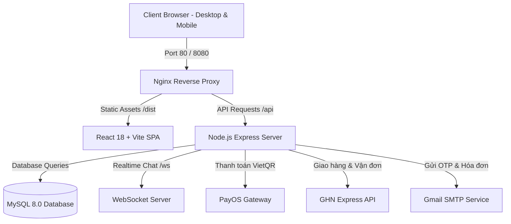

# 🎵 VỌC RECORDS — NỀN TẢNG THƯƠNG MẠI ĐIỆN TỬ VINYL & ANALOG AUDIO

<p align="center">
  
</p>

<p align="center">
  <strong>Website thương mại điện tử chuyên kinh doanh Đĩa Than (Vinyl), Băng Cassette, Mâm Đĩa (Turntable) và Phụ Kiện Âm Thanh Analog.</strong>
  <br />
  Thiết kế theo phong cách <strong>Neo-Brutalism</strong> cá tính, hiện đại và chuẩn trải nghiệm E-Commerce.
</p>

<p align="center">
  
  
  
  
  
  
  
</p>

---

## 📑 Mục Lục
- [Giới Thiệu](#-giới-thiệu)
- [Tính Năng Nổi Bật](#-tính-năng-nổi-bật)
  - [1. Dành Cho Khách Hàng (Storefront)](#1-dành-cho-khách-hàng-storefront)
  - [2. Quản Trị Hệ Thống (Admin Panel)](#2-quản-trị-hệ-thống-admin-panel)
- [Kiến Trúc & Công Nghệ](#-kiến-trúc--công-nghệ)
- [Cấu Trúc Thư Mục](#-cấu-trúc-thư-mục)
- [Hướng Dẫn Cài Đặt & Chạy Ứng Dụng](#-hướng-dẫn-cài-đặt--chạy-ứng-dụng)
  - [Chạy bằng Docker Compose (Khuyên dùng)](#cách-1-chạy-bằng-docker-compose-nhanh-nhất--khuyên-dùng)
  - [Chạy môi trường phát triển (Local Development)](#cách-2-chạy-phát-triển-local-development)
- [Cấu Hình Biến Môi Trường (.env)](#-cấu-hình-biến-môi-trường-env)
- [Cơ Sở Dữ Liệu & Sao Lưu (Backup / Restore)](#-cơ-sở-dữ-liệu--sao-lưu-backup--restore)
- [Tài Khoản Mẫu Trải Nghiệm](#-tài-khoản-mẫu-trải-nghiệm)
- [Thông Tin Cửa Hàng & Liên Hệ](#-thông-tin-cửa-hàng--liên-hệ)

---

## 📻 Giới Thiệu

**Vọc Records** là giải pháp nền tảng E-Commerce toàn diện dành cho cộng đồng yêu âm nhạc Analog tại Việt Nam:
- **Địa chỉ Showroom**: 54 Triều Khúc, Phường Thanh Xuân Nam, Quận Thanh Xuân, Hà Nội.
- **Hotline / Hỗ trợ**: 0766 255 478.
- **Đặc trưng thiết kế**: Phong cách nghệ thuật **Neo-Brutalism** với viền đen tương phản cao (High-contrast borders), bóng đổ khối sắc nét (Hard drop shadows), typography mạnh mẽ kết hợp cùng trải nghiệm mua sắm mượt mà trên cả Desktop và Mobile.

---

## ✨ Tính Năng Nổi Bật

### 1. Dành Cho Khách Hàng (Storefront)
- **Danh mục chuyên biệt**:
  - **Đĩa Than (Vinyl Records)**: Tuyển tập album kinh điển và hiện đại, phân loại chi tiết theo thể loại (Rock, Jazz, City Pop, Việt Nam, Electronic...), tình trạng bìa/đĩa và tracklist bài hát.
  - **Băng Cassette**: Album băng từ hoài niệm, âm thanh mộc mạc.
  - **Mâm Đĩa Than (Turntables)**: Các dòng mâm đĩa chính hãng (Audio-Technica, Pro-Ject, Sony...).
  - **Phụ Kiện Chăm Sóc**: Chổi quét carbon, dung dịch vệ sinh đĩa, bọc lót trong/ngoài cao cấp.
- **Tìm kiếm & Bộ lọc nâng cao**: Lọc sản phẩm theo danh mục, khoảng giá, thể loại nhạc và tình trạng tồn kho.
- **Giỏ Hàng (Cart) & Yêu Thích (Wishlist)**: Đồng bộ giỏ hàng và danh sách đĩa yêu thích theo thời gian thực.
- **Cổng Thanh Toán Tích Hợp**:
  - **COD (Thanh toán khi nhận hàng)**: Tiện lợi, an toàn.
  - **VietQR PayOS (Tự động đối soát)**: Tạo mã QR thanh toán ngân hàng tức thời, tự động nhận diện thanh toán thành công trong 2-3 giây.
  - **Bộ đếm thời gian PayOS (10 phút)**: Tự động đếm ngược; nếu quá hạn mà chưa chuyển khoản, hệ thống sẽ tự hủy đơn và **tự động hoàn lại số lượng tồn kho** cho sản phẩm.
- **Tích Hợp Giao Hàng Nhanh (GHN Express)**:
  - Tự động lấy danh mục Tỉnh/Thành, Phường/Xã chuẩn GHN API.
  - Tính cước phí vận chuyển chính xác theo địa chỉ thực tế của khách hàng.
  - Tra cứu mã vận đơn trực tiếp trên đơn hàng.
- **Quản Lý Tài Khoản (Account Dashboard)**:
  - Thống kê tổng số đơn hàng, đơn đang xử lý/giao, đơn hoàn thành và sản phẩm yêu thích.
  - **Sổ Địa Chỉ (GHN)**: Quản lý nhiều địa chỉ giao hàng, đặt địa chỉ mặc định, thêm/xóa địa chỉ thuận tiện.
  - **Chi Tiết Đơn Hàng**: Xem lại lộ trình đơn hàng, tình trạng giao hàng, chi tiết từng đĩa nhạc.
  - **Quy trình Hủy Đơn & Hoàn Tiền (Refund)**: Đối với đơn đã thanh toán online qua PayOS, khách hàng nhập form thông tin ngân hàng nhận lại tiền (Ngân hàng, STK, Tên chủ TK, Lý do) một cách minh bạch. Hệ thống tự động khóa nút hủy nếu đơn đã được tạo mã vận đơn GHN để bảo vệ đơn hàng đang vận chuyển.
  - **Đổi Mật Khẩu & Xác Thực OTP**: Bảo mật tài khoản với xác thực mã OTP qua Email.
- **Tương Tác & Cộng Đồng**:
  - **Chat Trực Tuyến Realtime**: Nhắn tin trực tiếp với nhân viên hỗ trợ qua WebSocket (tự động fallback sang REST API khi mất kết nối).
  - **Hỏi Đáp Sản Phẩm (Q&A)**: Khách hàng có thể đặt câu hỏi về album/thiết bị ngay dưới trang chi tiết sản phẩm.
  - **Blog & Hướng Dẫn Kỹ Thuật**: Cẩm nang bảo quản đĩa than, cân chỉnh cần kim mâm đĩa, review album kinh điển.

---

### 2. Quản Trị Hệ Thống (Admin Panel)
- **Bảo toàn Route & Trạng thái**: Tự động đồng bộ URL Search Params (`?tab=orders`, `?tab=products`...) và `localStorage`, ấn F5 / reload không bao giờ bị nhảy tab về Dashboard.
- **Dashboard & Báo Cáo Doanh Thu**:
  - Thống kê doanh thu hôm nay, tổng số đơn, số lượng khách hàng và biểu đồ tăng trưởng doanh thu theo ngày bằng Chart.js.
  - **Xuất Báo Cáo Doanh Thu Ra Excel**: Nút xuất file Excel (CSV chuẩn ký tự UTF-8 BOM `\uFEFF`) hiển thị tiếng Việt hoàn hảo, mở trực tiếp trên Microsoft Excel không bị lỗi font.
- **Quản Lý Đơn Hàng Toàn Diện**:
  - Danh sách đơn hàng với đầy đủ thông tin: Mã ĐH, Khách hàng, Thời gian, Tổng tiền, GHN, Trạng thái đơn, Cảnh báo hoàn tiền.
  - **Xem Chi Tiết Đơn Hàng (Modal Popup)**: Xem chi tiết người nhận, địa chỉ giao hàng, ghi chú, phương thức thanh toán, mã vận đơn GHN, bảng chi tiết từng sản phẩm và tổng tiền.
  - **Xuất / In Hóa Đơn Bán Lẻ (Retail Invoice)**: Nút xuất hóa đơn chuẩn khổ giấy A4 mang nhận diện thương hiệu Vọc Records (đầy đủ địa chỉ 54 Triều Khúc, hotline, chi tiết sản phẩm, tổng tiền, chữ ký xác nhận), hỗ trợ in trực tiếp hoặc lưu dưới dạng PDF chỉ với 1 click.
  - **Kiểm Soát Vận Đơn GHN**: Nút "TẠO GHN" được kiểm soát chặt chẽ — chỉ mở kích hoạt khi đơn đã ở trạng thái `ĐÃ XÁC NHẬN`, ngăn chặn tạo nhầm đơn vận chuyển.
  - **Xử Lý Hoàn Tiền Bán Tự Động**: Hiển thị thẻ cảnh báo đỏ nổi bật đối với các đơn hàng đã thanh toán bị hủy, hiển thị chi tiết số tài khoản ngân hàng của khách và nút bấm "✓ Xác nhận đã chuyển khoản" để đóng quy trình hoàn tiền.
- **Quản Lý Kho Hàng & Sản Phẩm (Inventory & Catalog)**:
  - Thêm mới, chỉnh sửa thông tin, giá bán, tồn kho, nhóm sản phẩm, thể loại, định dạng bìa đĩa, quy cách, tracklist bài hát và hình ảnh.
- **Quản Lý Khách Hàng**: Theo dõi lịch sử mua hàng, tổng chi tiêu của từng khách hàng.
- **Quản Lý Đổi Trả / Khiếu Nại (Returns)**: Quy trình tiếp nhận yêu cầu đổi trả, kiểm tra và chỉ hoàn lại số lượng tồn kho khi đơn đổi trả chuyển sang trạng thái `Hoàn tất`.
- **Hỏi Đáp Sản Phẩm & Chat CSKH**: Duyệt/ẩn bình luận hỏi đáp và giao diện trả lời tin nhắn trực tiếp với khách hàng.
- **Quản Lý Nội Dung (CMS)**: Soạn thảo, xuất bản và quản lý bài viết Blog, bài Hướng dẫn kỹ thuật.
- **Mã Giảm Giá (Discount Vouchers)**: Quản lý mã khuyến mãi, phần trăm chiết khấu hoặc giảm tiền mặt cố định.
- **Phân Quyền Nhân Sự**: Quản lý tài khoản nhân viên và phân chia quyền hạn chặt chẽ (Admin / Nhân viên).

---

## 🛠 Kiến Trúc & Công Nghệ



### Công Nghệ Sử Dụng
| Thành Phần | Công Nghệ / Thư Viện |
| :--- | :--- |
| **Frontend** | React 18, Vite, TypeScript, React Router v7, Lucide React, Chart.js, Neo-Brutalist CSS |
| **Backend** | Node.js, Express.js, MySQL2 (Connection Pool), WebSocket (`ws`), JWT, Bcrypt |
| **Cơ sở dữ liệu** | MySQL 8.0 (InnoDB, `utf8mb4_unicode_ci`) |
| **Bên thứ ba** | Cổng thanh toán VietQR PayOS, Giao Hàng Nhanh (GHN), Nodemailer (Gmail SMTP) |
| **DevOps / Hosting** | Docker, Docker Compose, Nginx, AWS Lightsail / EC2 Ubuntu |

---

## 📂 Cấu Trúc Thư Mục

```text
vocrecord/
├── DiaNhac/                    # Mã nguồn Frontend (React + Vite)
│   ├── public/                 # Ảnh tĩnh, logo, catalog sản phẩm
│   ├── src/
│   │   ├── app/
│   │   │   ├── components/     # Header, MobileNav, Admin Chat/Discounts/Employees...
│   │   │   ├── context/        # CartContext, WishlistContext
│   │   │   ├── pages/          # Home, Shop, ProductDetail, Cart, Checkout, Account, Admin, OrderDetail...
│   │   │   ├── routes.tsx      # Cấu hình định tuyến
│   │   │   └── config/api.ts   # Cấu hình API Endpoint
│   │   └── styles/             # Stylesheets Neo-Brutalism & Component styles
│   ├── package.json
│   └── vite.config.ts
│
├── server/                     # Mã nguồn Backend (Node.js + Express)
│   ├── src/
│   │   ├── config/             # Cấu hình kết nối MySQL pool
│   │   ├── middleware/         # Auth JWT, phân quyền, rate limit, error handler
│   │   ├── models/             # Data access models (SanPham, DonHang, TaiKhoan...)
│   │   ├── routes/             # REST API routes (order, product, payos, shipping, account...)
│   │   ├── services/           # Nghiệp vụ PayOS, GHN API, Email OTP, WebSocket Chat
│   │   └── index.js            # Server entry point
│   ├── .env.example            # Mẫu cấu hình môi trường backend
│   ├── Dockerfile
│   └── package.json
│
├── database/                   # Migrations và dữ liệu mẫu MySQL
│   ├── 01_init_database.sql
│   ├── 02_migrate.sql
│   ├── 03_migrate_email_otp.sql
│   ├── 04_fix_broken_images.sql
│   ├── 05_seed_content_catalog.sql
│   ├── 06_migrate_shipping_interactions.sql
│   ├── 07_migrate_chat_and_indexes.sql
│   └── backup_clonevocrecord_latest.sql   # Bản backup đầy đủ dữ liệu mới nhất
│
├── docker-compose.yml          # Cấu hình Docker toàn bộ hệ thống (Web, API, DB)
├── nginx.conf                  # Cấu hình Nginx reverse proxy
└── README.md                   # Tài liệu hướng dẫn dự án
```

---

## 🚀 Hướng Dẫn Cài Đặt & Chạy Ứng Dụng

### Cách 1: Chạy bằng Docker Compose (Nhanh nhất & Khuyên dùng)

> [!TIP]
> Đảm bảo máy tính của bạn đã cài đặt **Docker Desktop** và đang chạy.

1. **Clone mã nguồn dự án:**
   ```bash
   git clone https://github.com/TDat2005/vocrecord.git
   cd vocrecord
   ```

2. **Cấu hình file môi trường:**
   Tạo file `server/.env` từ file mẫu `server/.env.example`:
   ```bash
   cp server/.env.example server/.env
   ```
   *(Cập nhật thông tin cấu hình PayOS, GHN và Email nếu cần chạy tính năng thật)*.

3. **Khởi động toàn bộ hệ thống:**
   ```bash
   docker compose up -d --build
   ```

4. **Truy cập ứng dụng:**
   * **Website Vọc Records**: [http://localhost:8080](http://localhost:8080)
   * **Trang Quản Trị Admin**: [http://localhost:8080/#/admin](http://localhost:8080/#/admin)

---

### Cách 2: Chạy phát triển (Local Development)

Nếu bạn muốn can thiệp code và reload giao diện ngay lập tức với Vite HMR:

#### 1. Khởi động MySQL Database:
Bạn có thể dùng MySQL cài sẵn trên máy (XAMPP / MySQL Server) hoặc dùng Docker để chạy riêng DB:
```bash
docker compose up -d db
```

#### 2. Khởi động Backend Server:
```bash
cd server
npm install
npm run dev
# Server lắng nghe tại: http://localhost:3000
```

#### 3. Khởi động Frontend React (Vite):
```bash
cd DiaNhac
npm install
npm run dev
# Mở trình duyệt tại: http://localhost:5173
```

---

## 🔐 Cấu Hình Biến Môi Trường (.env)

Tạo file `server/.env` với các trường thông tin:

```env
PORT=3000
NODE_ENV=production

# Kết nối MySQL Database
DB_HOST=db
DB_PORT=3306
DB_USER=root
DB_PASS=your_db_password
DB_NAME=clonevocrecord

# Bảo mật JWT
JWT_SECRET=your_super_secret_jwt_key_here

# Cổng thanh toán VietQR PayOS (https://payos.vn)
PAYOS_CLIENT_ID=your_payos_client_id
PAYOS_API_KEY=your_payos_api_key
PAYOS_CHECKSUM_KEY=your_payos_checksum_key

# Dịch vụ vận chuyển Giao Hàng Nhanh (GHN)
GHN_TOKEN=your_ghn_api_token
GHN_SHOP_ID=your_ghn_shop_id
GHN_ENV=staging
GHN_FROM_DISTRICT_ID=1488
GHN_FROM_WARD_CODE=1A0307

# Gửi Email OTP & Thông báo (Gmail SMTP)
EMAIL_USER=your_email@gmail.com
EMAIL_PASS=your_gmail_app_password
```

---

## 💾 Cơ Sở Dữ Liệu & Sao Lưu (Backup / Restore)

File cơ sở dữ liệu mới nhất được đặt tại: `database/backup_clonevocrecord_latest.sql`

### 1. Nhập dữ liệu (Restore / Import) vào Docker MySQL:
```bash
docker exec -i vocrecord-db-1 sh -c 'mysql -u root -p"$MYSQL_ROOT_PASSWORD" clonevocrecord' < database/backup_clonevocrecord_latest.sql
```

### 2. Xuất dữ liệu mới (Backup / Export):
```bash
docker exec vocrecord-db-1 sh -c 'mysqldump -u root -p"$MYSQL_ROOT_PASSWORD" --default-character-set=utf8mb4 clonevocrecord' > backup_vocrecord.sql
```

---

## 👤 Tài Khoản Mẫu Trải Nghiệm

| Vai Trò | Email Đăng Nhập | Mật Khẩu | Quyền Hạn |
| :--- | :--- | :--- | :--- |
| **Quản Trị Viên (Admin)** | `admin@vocrecord.local` | `Admin@12345` | Toàn quyền quản lý cửa hàng, đơn hàng, hóa đơn, doanh thu, nhân sự |
| **Khách Hàng Mẫu** | `demo@vocrecord.local` | `Demo@12345` | Mua hàng, thanh toán PayOS/COD, quản lý sổ địa chỉ, đổi mật khẩu |

---

## 📍 Thông Tin Cửa Hàng & Liên Hệ

* **Tên thương hiệu**: **VỌC RECORDS**
* **Địa chỉ**: 54 Triều Khúc, Phường Thanh Xuân Nam, Quận Thanh Xuân, Hà Nội
* **Hotline / Zalo**: 0766 255 478
* **GitHub Repository**: [https://github.com/TDat2005/vocrecord](https://github.com/TDat2005/vocrecord)
* **Người phát triển**: [TDat2005](https://github.com/TDat2005)

---

<p align="center">
  <sub>© 2026 Vọc Records. Thiết kế và phát triển với niềm đam mê âm thanh Analog.</sub>
</p>
